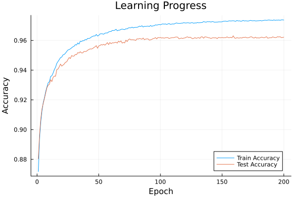

# Feedback Alignment for MNIST Classification

This project implements a neural network trained on the MNIST dataset using the Direct Feedback Alignment (DFA) algorithm instead of traditional backpropagation. The primary goal of this implementation is to provide a clear and understandable example of how the DFA algorithm works, as described in the paper ["Direct Feedback Alignment Provides Learning in Deep Neural Networks"](https://arxiv.org/abs/1609.01596).

## Overview

This code is designed as an educational tool to clarify the DFA algorithm, rather than as a high-performance or state-of-the-art implementation. It prioritizes readability and simplicity over speed or achieving the best possible accuracy.

The implementation trains a 3-layer neural network (784 -> 64 -> 32 -> 10) on the MNIST dataset.
## Libraries Used

This implementation uses the following Julia libraries which will need to be installed to run the code: MLDatasets, OneHotArrays, LinearAlgebra, Random, ProgressMeter, Plots

## Results

The graph above shows the training progress over 200 epochs:

- Train Accuracy: The accuracy of the model on the training set
- Test Accuracy: The accuracy of the model on the test set

## Code Description

The main components of the code are:

1. Data Preparation: Load and preprocess the MNIST dataset.
2. Network Initialization: Initialize the weights and feedback alignment matrices.
3. Training Loop:
   - Forward pass through the network
   - Error calculation
   - Backward pass using feedback alignment matrices
   - Weight updates
4. Evaluation: Calculate and store training accuracy, test accuracy, and training loss for each epoch.
5. Visualization: Plot the learning progress over time.

Each of these steps is implemented with clarity as the primary goal, allowing readers to easily follow the Feedback Alignment algorithm's process.
